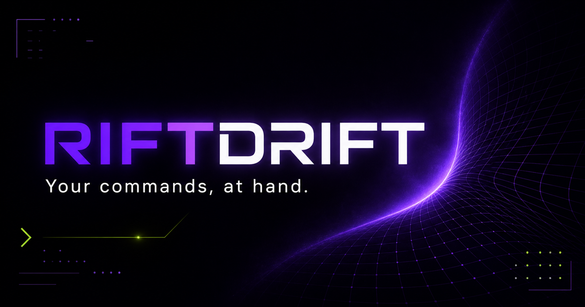

<p align="center">
  
</p>

<h1 align="center">RiftDrift</h1>

<p align="center">
  A native terminal with a command library built into the workspace.
</p>

<p align="center">
  <a href="https://github.com/Sergatch/RiftDrift/releases/latest"></a>
  
  
</p>

<p align="center">
  <a href="#why">Why</a> ·
  <a href="#features">Features</a> ·
  <a href="#getting-started">Getting started</a> ·
  <a href="#the-library-file">Library format</a> ·
  <a href="#how-it-is-built">Architecture</a>
</p>

RiftDrift is a personal project. I built it because I wanted a real terminal and a shelf of commands in the same window, without turning my shell history, notes, and snippets into three separate systems.

It is made around my own workflow and released as-is. If it fits yours, use it, change it, or take the useful parts and make them your own.

## Why

Shell history is good at remembering what happened. It is less good at keeping the commands that matter organized and close at hand.

RiftDrift keeps the terminal familiar and adds a small library beside it:

```text
┌──────────────────────────────────────────┬─────────────────────────┐
│  riftdrift                         zsh   │  COMMAND LIBRARY        │
├──────────────────────────────────────────┼─────────────────────────┤
│                                          │  Deploy                 │
│  ~/projects/riftdrift                    │    production deploy    │
│  $ git status --short                    │    check containers     │
│                                          │                         │
│  M README.md                             │  Project                │
│                                          │    build desktop        │
│  $ _                                     │    run checks           │
│                                          │                         │
│                                          │  Last                   │
│                                          │    git status --short   │
└──────────────────────────────────────────┴─────────────────────────┘
```

Saved commands stay named and grouped. Recent commands stay easy to scan. Selecting a command inserts it at the prompt but does not execute it, so there is always a chance to review or edit it first.

## Features

### A real terminal

- Native pseudo-terminal sessions powered by Rust and `portable-pty`.
- The user's own shell, environment, startup files, aliases, and prompt.
- True-color output through xterm.js.
- Lightweight command highlighting for zsh without replacing the user's dotfiles.
- Up to 10,000 visible xterm.js scrollback lines and a 2 MB backend scrollback buffer per live session.

### Tabs that can leave the window

- Open multiple independent terminal sessions with `Cmd/Ctrl + T`.
- Reorder tabs by dragging them along the tab bar.
- Double-click a tab, or drag it outside the window, to detach the same live session into its own native window.
- Closing the last main-window tab immediately creates a fresh shell.

### A command library, not another notes app

- Every submitted command is captured in **Last**, de-duplicated, and moved to the top.
- Up to 999 ordinary history entries are retained; commands saved to a section are not dropped by that limit.
- Create, rename, delete, and reorder custom sections.
- Save commands to a section, move them between sections, and reorder them with dedicated drag handles.
- Give saved commands short display names while keeping their full command text intact.
- Removing a command from a section keeps it in recent history.
- Deleting a section also keeps its commands in recent history.
- Click a library entry to insert it into the active terminal without running it.

### Local and portable by default

- Library changes are saved automatically as readable JSON.
- The active library path is remembered between launches.
- **Save as** creates a portable `.riftdrift` file containing sections, command history, names, and ordering.
- Opening a library replaces the current library view with the contents of that file.
- No account, server, analytics service, or cloud sync is involved in the desktop app.

## Platform support

| Platform | Status | Notes |
| --- | --- | --- |
| macOS | Primary | Native app and DMG builds, login-shell support, `.riftdrift` file association, and native Open/Save as dialogs. Minimum macOS version: 10.15. |
| Windows | Supported | Native PowerShell or configured shell sessions, NSIS and MSI installers, plus an x64 NSIS cross-build from macOS. The in-app `.riftdrift` file picker is not wired up on Windows yet. |
| Linux | Unspecified | The underlying stack is portable, but Linux is not currently a packaged or tested release target for this project. |

Local macOS builds are ad-hoc signed. Windows installers are unsigned. Expect Gatekeeper or SmartScreen warnings until a build is signed for distribution.

## Getting started

### Prerequisites

- Node.js 22.13 or newer
- Rust 1.77.2 or newer
- Platform requirements from the [Tauri prerequisites guide](https://v2.tauri.app/start/prerequisites/)

Clone the repository and install the locked dependencies:

```bash
git clone https://github.com/Sergatch/RiftDrift.git
cd RiftDrift
npm ci
```

Start the native app in development mode:

```bash
npm run dev
```

Tauri starts the Vite frontend automatically and opens RiftDrift as a desktop application. The terminal backend runs the user's shell inside a real PTY; it is not a simulated browser terminal.

### Useful commands

| Command | Purpose |
| --- | --- |
| `npm run dev` | Run the native desktop app in development mode. |
| `npm run build` | Build release bundles for the current operating system. |
| `npm run build:mac` | Build the macOS `.app` bundle and DMG. |
| `npm run build:windows` | Build NSIS/MSI on Windows, or cross-build x64 NSIS from macOS. |
| `npm run check:desktop` | Run TypeScript checking and `cargo check`. |
| `npm run lint` | Run ESLint across the project. |
| `npm run site:dev` | Run the original browser prototype. It demonstrates the interface but does not provide a real shell. |

See [BUILDING.md](BUILDING.md) for Windows toolchains, macOS signing and notarization, universal Apple Silicon/Intel builds, CI artifacts, and exact output paths.

## Everyday use

### Keyboard

| Shortcut | Action |
| --- | --- |
| `Cmd + T` / `Ctrl + T` | Open a new terminal tab. |
| `Cmd + L` / `Ctrl + L` | Show or hide the command library. |
| `Esc` | Close an open menu or editor dialog. |
| Shell history keys | Continue to work inside the active shell as usual. |

### Saving a command

1. Run it normally in the terminal. It appears at the top of **Last**.
2. Open its save menu and choose a section, or create a new one in place.
3. Optionally give it a shorter display name.
4. Drag it to set its position inside the section.

RiftDrift records a command when it is submitted, but library commands are only inserted when selected. Nothing from the library is executed automatically.

### Working with tabs

Drag a tab over another tab to reorder it. Drop it outside the app window, or double-click it, to move the live PTY session into a separate window. Its recent output is restored from the backend scrollback buffer when the new view attaches.

## The library file

The default library is stored in the operating system's application-data directory as `RiftDrift Library.riftdrift`. The file is plain versioned JSON, so it is easy to inspect, back up, diff, or carry to another machine.

A simplified document looks like this:

```json
{
  "version": 2,
  "sections": [
    {
      "id": "section-example",
      "name": "Project"
    }
  ],
  "history": [
    {
      "id": "command-example",
      "text": "npm run check:desktop",
      "sectionId": "section-example",
      "displayName": "run desktop checks",
      "savedOrder": 0
    }
  ]
}
```

Writes go through a temporary file before replacing the active library, which avoids leaving a partially written document behind. Invalid JSON is refused by the native backend. Older browser-prototype data is migrated when no native library exists yet.

## How it is built

```text
React + xterm.js
       │
       │ Tauri commands and events
       ▼
Rust application core
       ├── PTY lifecycle and scrollback
       ├── native windows
       ├── shell integration
       └── library file persistence
```

| Area | Technology | Responsibility |
| --- | --- | --- |
| Desktop UI | React 19, TypeScript, Vite | Tabs, terminal views, command library, editors, drag-and-drop interactions. |
| Terminal rendering | xterm.js | Input, ANSI output, selection, colors, and viewport scrollback. |
| Native core | Tauri 2, Rust | PTYs, process I/O, window management, filesystem access, and app packaging. |
| Shell process | `portable-pty` | Starts and controls a native shell for every tab. |
| Browser prototype | Next.js-compatible app via Vinext | Keeps the original interactive design prototype available separately. |

The main project areas are intentionally small:

```text
desktop/          native desktop frontend
src-tauri/        Rust backend and Tauri configuration
app/              browser prototype
scripts/          cross-platform build helpers
.github/workflows Windows CI build
public/           shared visual assets
```

## Project boundaries

RiftDrift is intentionally local and narrow. It is not trying to be an SSH manager, a secrets vault, a cloud notebook, or a replacement for shell configuration. There is no sync engine, plugin marketplace, shared workspace, or compatibility promise for every shell.

The project follows the problems I actually encounter while using it. Issues and focused pull requests are welcome, but there is no formal support schedule or roadmap.

## Building for distribution

The short version:

```bash
# macOS app + DMG
npm run build:mac

# Windows NSIS + MSI when run on Windows
# Windows x64 NSIS when cross-built from macOS
npm run build:windows
```

The **Build Windows** GitHub Actions workflow always produces an Actions artifact. When a tag matching `v*` is pushed, it also publishes a [GitHub Release](https://github.com/Sergatch/RiftDrift/releases/latest) with downloadable NSIS and MSI installers and automatically generated release notes.

Before a release, keep the version aligned in `package.json`, `src-tauri/Cargo.toml`, and `src-tauri/tauri.conf.json`. Signing credentials should only be supplied through the local environment or CI secrets and must never be committed.

## Closing note

RiftDrift started as the terminal I wanted on my own machine. That is still the standard for it: small enough to understand, useful without an account, and opinionated where it saves time.

If that is also what you need, take it from here.
